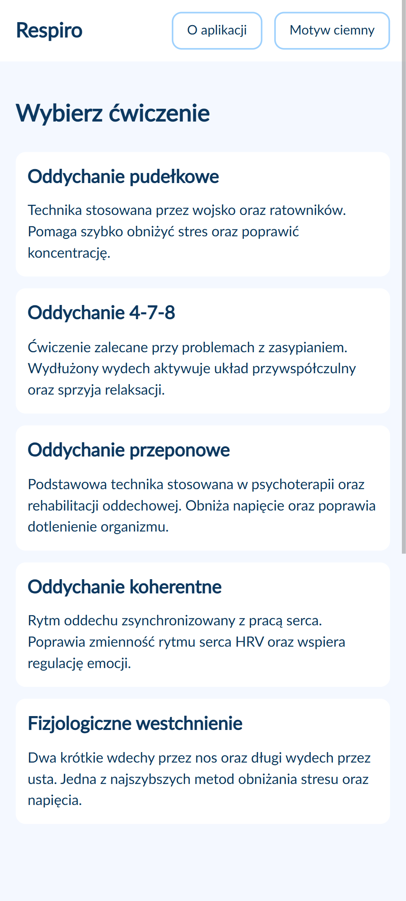
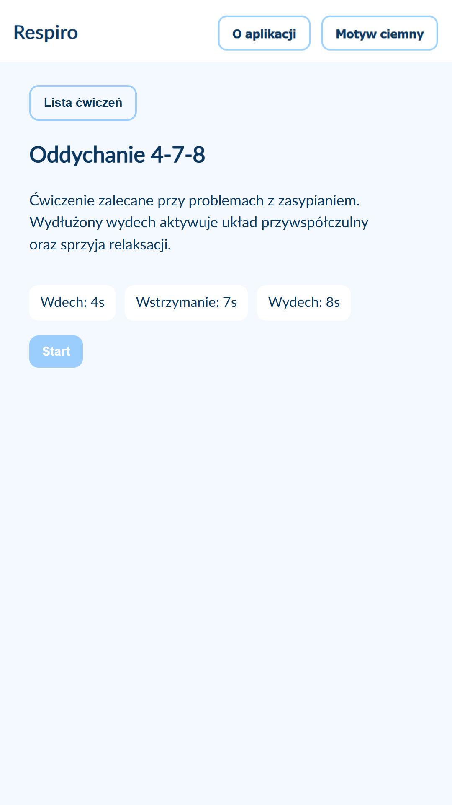
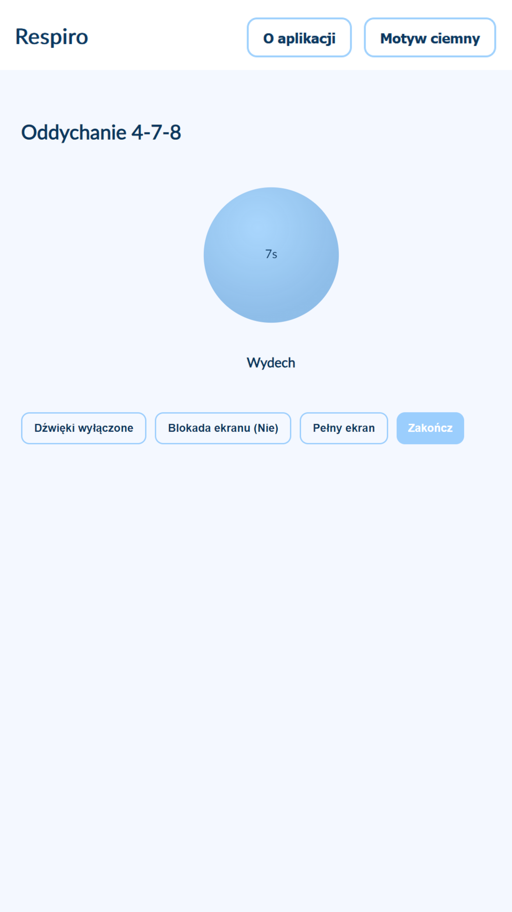

### Respiro – aplikacja do ćwiczeń oddechowych (PWA)

Respiro to prosta aplikacja webowa do wykonywania ćwiczeń oddechowych.  
Aplikacja prowadzi użytkownika przez sesje oddechowe z podziałem na fazy oraz opcjonalnymi dźwiękami.  
Działa również offline jako Progressive Web App (PWA).

  
  
  

### Funkcje

- Lista ćwiczeń oddechowych
- Prowadzone sesje z fazami oddechu
- Wizualizacja oddechu
- Opcjonalne dźwięki zmiany faz
- Tryb pełnoekranowy
- Blokada wygaszania ekranu
- Motyw jasny i ciemny
- Działanie offline (PWA)
- Responsywny interfejs
  

### Technologie

- HTML5
- CSS
- JavaScript
- Progressive Web App (Service Worker, manifest)
- Web APIs (Fullscreen API, Wake Lock API, Network Status API)

### Tryb offline

Po pierwszym uruchomieniu aplikacja działa offline dzięki Service Workerowi.
Podczas braku połączenia z internetem użytkownik otrzymuje informację o trybie offline.

### Możliwe rozszerzenia

- Timer ćwiczeń
- Statystyki ćwiczeń
- Obsługa wibracji (Vibration API)

### Instalacja i uruchomienie projektu (Visual Studio Code)

Projekt można uruchomić lokalnie przy użyciu Visual Studio Code oraz rozszerzenia Live Server.

Wymagania:
- Visual Studio Code
- Rozszerzenie Live Server

Aby uruchomić aplikację:

1. Pobierz powyższe repozytorium.

2. Otwórz folder projektu w Visual Studio Code.

3. Zainstaluj rozszerzenie Live Server, jeśli nie jest jeszcze zainstalowane.

4. Kliknij prawym przyciskiem myszy na plik index.html i wybierz „Open with Live Server”.
